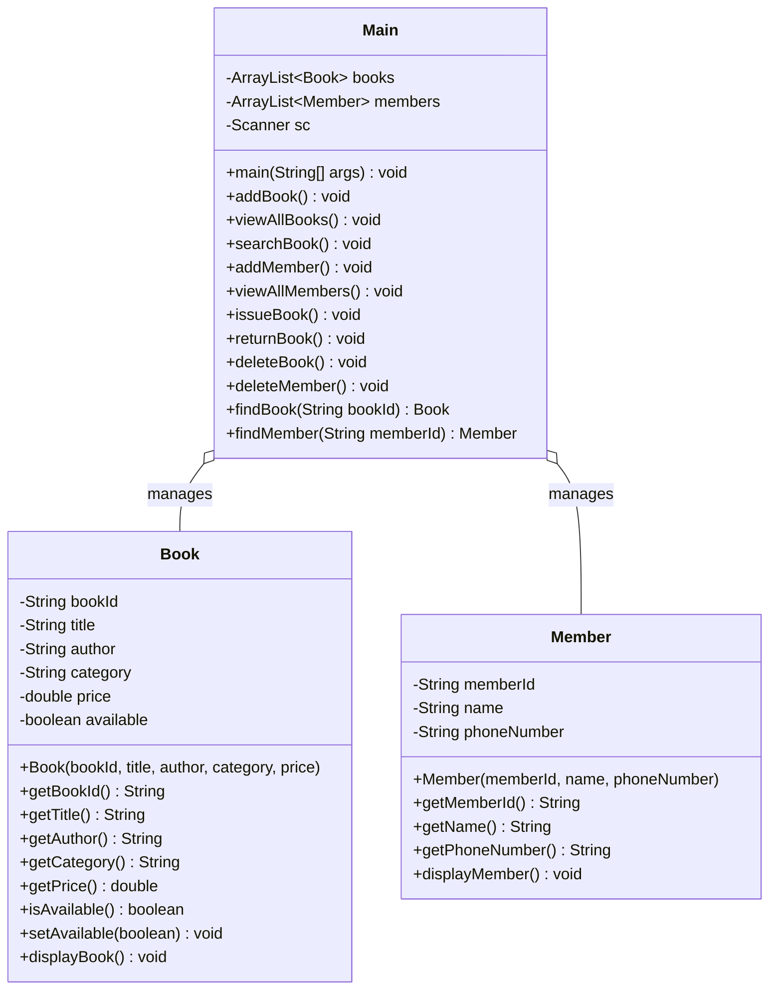
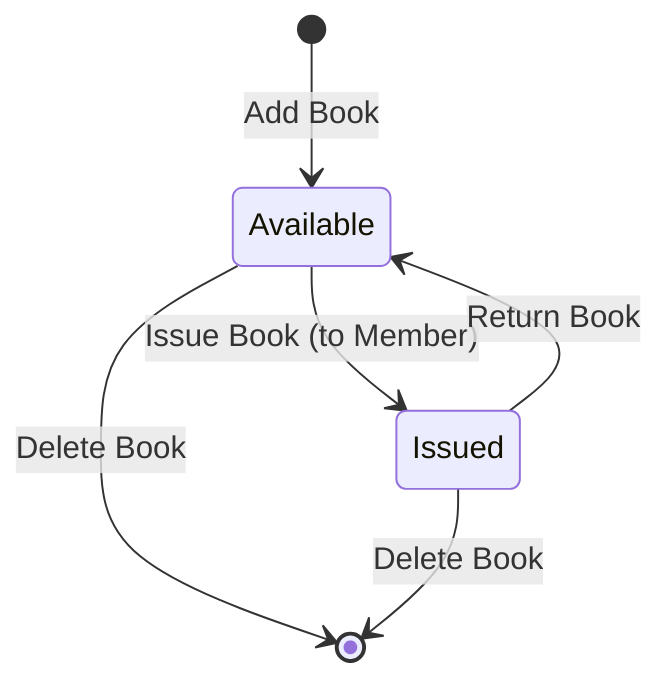

# 📚 Library Management System

[](https://www.oracle.com/java/)
[](https://github.com/SorathiyaDhruvin/Library-Management-System)
[](LICENSE)
[]()

A robust, console-based **Library Management System** built with **Core Java** and Object-Oriented Programming (OOP) principles. This system provides a fast, intuitive CLI to manage book inventories, library members, and book circulation (issue and return operations) with duplicate validation and error handling.

---

## 📌 Table of Contents

- [Overview](#-overview)
- [Key Features](#-key-features)
- [System Architecture](#-system-architecture)
- [Project Structure](#-project-structure)
- [Prerequisites](#-prerequisites)
- [Installation & Execution](#-installation--execution)
- [Menu Walkthrough & Sample Output](#-menu-walkthrough--sample-output)
- [OOP Concepts Applied](#-oop-concepts-applied)
- [Roadmap & Future Enhancements](#-roadmap--future-enhancements)
- [Author](#-author)
- [License](#-license)

---

## 📖 Overview

The **Library Management System** is designed to streamline day-to-day library operations without needing external heavy dependencies or complex database configurations. Utilizing Java's Collection Framework (`ArrayList`), it maintains in-memory tracking of books and members, ensuring fast lookups, validations, and state changes.

---

## ✨ Key Features

### 📖 Book Management
- **Add New Books**: Register books with unique Book ID, title, author, category, and price. Includes duplicate ID checks and validation against negative pricing.
- **View All Books**: List all books along with their complete metadata and live availability status (`Available` / `Issued`).
- **Search Book**: Instantly find any book by its ID (case-insensitive).
- **Delete Book**: Remove obsolete or lost books from the system.

### 👥 Member Management
- **Register Member**: Add library members with unique Member ID, full name, and phone contact. Prevents duplicate registrations.
- **View All Members**: View full roster of registered library patrons.
- **Delete Member**: De-register members cleanly by Member ID.

### 🔄 Book Circulation (Issue / Return)
- **Issue Book**:
  - Validates book availability.
  - Verifies member registration before checkout.
  - Automatically updates book status from `Available` to `Issued`.
- **Return Book**:
  - Validates whether the book is currently marked as issued.
  - Restores status back to `Available`.

### 🛡️ Input Validation & Safety
- Duplicate key prevention for both books and members.
- Validation checks for book price inputs.
- Safe resource handling and clean application shutdown.

---

## 🏗️ System Architecture



### Book State Lifecycle



---

## 📂 Project Structure

```text
Library Management System/
│
├── Book.java          # Book entity model with encapsulation & display logic
├── Member.java        # Member entity model with patron details
├── Main.java          # CLI controller, business logic & menu loop
└── README.md          # Project documentation
```

---

## ⚙️ Prerequisites

Before running the project, ensure you have the following installed:

- **Java Development Kit (JDK)**: Version 8 or higher
  - Verify your installation:
    ```bash
    java -version
    javac -version
    ```
- **Git** (optional, for cloning)

---

## 🚀 Installation & Execution

### 1. Clone the Repository
```bash
git clone https://github.com/SorathiyaDhruvin/Library-Management-System.git
cd Library-Management-System
```

### 2. Compile Java Source Files
Compile all `.java` files using the Java Compiler:
```bash
javac *.java
```

### 3. Run the Application
Execute the compiled `Main` class:
```bash
java Main
```

---

## 💻 Menu Walkthrough & Sample Output

Upon starting the program, you will see the interactive terminal menu:

```text
======================================
       LIBRARY MANAGEMENT SYSTEM
======================================
1. Add Book
2. View All Books
3. Search Book
4. Add Member
5. View All Members
6. Issue Book
7. Return Book
8. Delete Book
9. Delete Member
10. Exit

Enter your choice: 1
```

### Sample: Adding and Viewing a Book
```text
===== ADD BOOK =====
Enter Book ID: B101
Enter Book Title: Clean Code
Enter Author Name: Robert C. Martin
Enter Category: Programming
Enter Price: 499.0
Book added successfully!

===== ALL BOOKS =====
------------------------------
Book ID    : B101
Title      : Clean Code
Author     : Robert C. Martin
Category   : Programming
Price      : ₹499.0
Status     : Available
------------------------------
```

### Sample: Issuing a Book
```text
===== ISSUE BOOK =====
Enter Book ID: B101
Enter Member ID: M01
Book issued successfully!
Book  : Clean Code
Member: John Doe
```

---

## 🧩 OOP Concepts Applied

| Concept | Implementation in this Project |
| :--- | :--- |
| **Encapsulation** | Private variables (`bookId`, `title`, `available`, etc.) accessed through getter/setter methods. |
| **Modularity** | Domain models (`Book`, `Member`) decoupled from the control/interaction logic (`Main`). |
| **Data Abstraction** | Internal state management (e.g., availability status flag) handled via standard method interfaces. |
| **Collections** | In-memory storage managed using dynamic generic collections (`ArrayList<Book>`, `ArrayList<Member>`). |

---

## 🔮 Roadmap & Future Enhancements

- [ ] **Persistent Storage**: Integrate SQLite / MySQL via JDBC or file-based serialization (`JSON`/`CSV`).
- [ ] **Graphical User Interface (GUI)**: Create a modern desktop app with JavaFX or Swing.
- [ ] **Borrow History & Due Dates**: Track borrowing timestamps, return deadlines, and automatic fine calculation.
- [ ] **User Roles & Authentication**: Implement Admin and Student/Member login portals.
- [ ] **REST API**: Migrate backend to Spring Boot for web and mobile client support.

---

## 👤 Author

**Dhruvin Sorathiya**
- GitHub: [@SorathiyaDhruvin](https://github.com/SorathiyaDhruvin)
- Repository: [Library-Management-System](https://github.com/SorathiyaDhruvin/Library-Management-System)

---

## 📄 License

This project is open-source and available under the [MIT License](LICENSE). Feel free to use, modify, and distribute it for academic or personal learning!